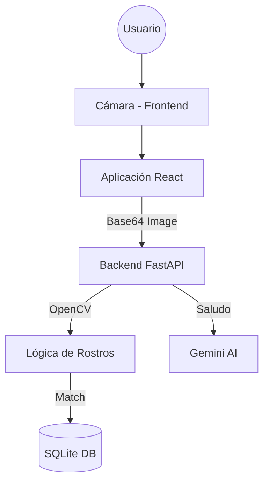

# Bienvenida a la Documentación de Face Attendance

Este proyecto es un sistema de control de asistencia basado en **Reconocimiento Facial**. Utiliza tecnologías modernas para ofrecer una experiencia fluida tanto a administradores como a usuarios finales.

## 🚀 Características Principales

- **Registro con Múltiples Ángulos**: Captura de rostro en diferentes posiciones para mayor precisión.
- **Reconocimiento en Tiempo Real**: Identificación rápida usando OpenCV (YuNet + SFace).
- **Control de Sesiones**: Validación estricta de Entrada/Salida para evitar duplicados.
- **Optimizado para RAM**: Diseñado para correr en entornos con recursos limitados (como Render o Raspberry Pi).

## 🛠 Stack Tecnológico

| Componente | Tecnología |
| :--- | :--- |
| **Backend** | Python 3.12, FastAPI, SQLAlchemy |
| **IA/Visión** | OpenCV (YuNet, SFace), Google Gemini API |
| **Frontend** | React (Vite), Axios, Lucide Icons |
| **Base de Datos** | SQLite (Soportado para producción en nube) |

## 🏗 Arquitectura Básica

---

Sigue la guía de [Instalación](installation.md) para comenzar.
